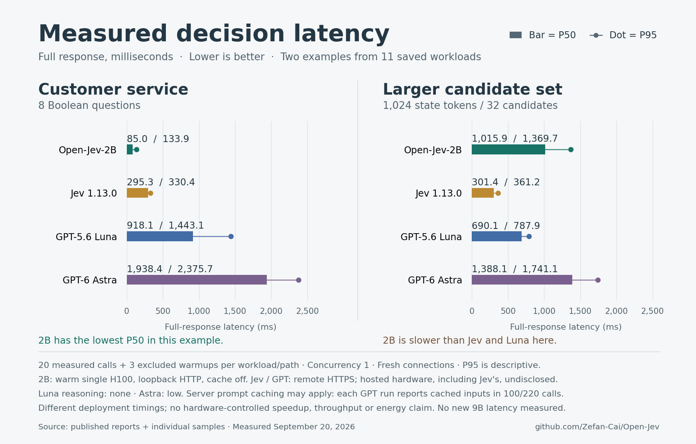

# Open-Jev benchmark update on X

Published September 21, 2026: [main post and 12 numbered replies](https://x.com/Zefan_Cai/status/2101845509170417784).

The thread compares Open-Jev, Jev 1.13.0, GPT-5.6 Luna and GPT-6 Astra using saved quality and latency evaluations. It reports the common 76-case reference check alongside its post-hoc label sensitivity, separate API quality suites, two contrasting latency workloads, caching limitations, and audited TREC-DL retrieval results. New Open-Jev domain and full-corpus evaluations remain pending.

[Complete thread text](thread.md) · [Public post verification](publication.json) · [Live results and methods](https://zefan-cai.github.io/open-jev/#comparison)



The main post includes this chart and its [image description](alt-text.txt). Latency measurements compare a warm 2B model on one H100 over loopback HTTP against hosted HTTPS APIs; they do not establish a hardware-controlled speedup. The larger candidate example retains the result where 2B is slower than Jev and Luna.

## Reproduce the chart

The [renderer](render_latency.py) reads the published latency reports and individual samples, verifies hashes and recomputes all eight plotted P50/P95 pairs. It makes no inference or network requests.

```bash
python -m pip install matplotlib==3.10.8
python release/social/comparison-update-20260921/render_latency.py
```

The original render used Python 3.12 and produced an 1800 × 1150 PNG. Quality methods, frozen-reference limitations and the distinct strict/scalar TREC results are documented in [provider comparison](../../../docs/provider-comparison.md).
